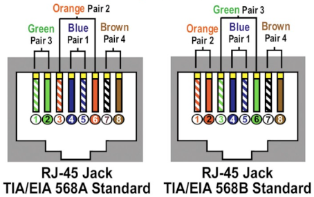

# CompTIA Network+ (Exam N10-007) Cheatsheet

## Chapter 1

## Chapter 2

## Chapter 3

### Diagrams
#### Ethernet Header
preamble (+SFD)|dst address|src address|Ehtertype|payload
---|---|---|---|---
8 bytes|6 bytes|6 bytes|2 bytes|64 - 1500 bytes

#### TIA/EIA 568A/568B Wiring Diagram

### Tables
#### Layer 1 and 2 Network devices
Device|OSI Layer|Ports|Use
---|---|---|---
repeater|1|2|dumb, physical layer device used to join two networks into a single network. Used to extend the distance of a cable run.
bridge|2|2|like a repeater but learns which MAC addresses live on each side and only repeats traffic when the destination MAC is on the other side or if it doesn't know which side it is on.
hub|1|varies|a multi-port repeater. Used to join several cables into a single network.  Seldom used as hubs create a single collision domain for all devices and bandwidth is shared among all devices (half-duplex operation results in only one device on the entire network able to send data at any given time).
switch|2|varies|a multi-port bridge. Used to join several cables into a single network.  Has replaced hubs as standard device for creating networks as each port is its own collision domain (i.e. no collisions when using full-duplex) and each device can use the full bandwidth of the switch (i.e. a Gigabit switch provides Gigabit speeds to each port).

#### Older Ethernet Specifications
Specification|Max Nodes|Speed|Max Cable Length|Min. Cable Type|Connector
---|---|---|---|---|---
10BaseT|1024 nodes|10Mbps|100m|Cat 3 UTP|RJ45
10BaseFL|1024 nodes|10Mbps|2000m|multimode fiber|SC or ST

### Definitions
Term|Definition
---|---
BPDU guard|disables PC ports (ports assigned the PortFast flag) if it sees a BPDU packet
BPDU|Bridge Protocol Data Unit.  Used instead of "packet" when talking about  Spanning Tree Protocol (STP)
Baseband| A connection that carries only a single signal.
Broadband| A connection that carries multiple signals at different frequencies.
Broadcast Domain|
Broadcast|
CAM table|Content Addressable Memory table
CSMA/CD| Carrier Sense Multiple Access/Collision Detection. A term describing how  Ethernet works.  Multiple devices access the network simultaneously and  listen for traffic.  They only send when they do not hear other traffic and they  listen for collisions while sending.  When a collision is detected, both  senders stop, wait a random amount of time, and then try again.
Collision Domain|The area in which a collision can occur in a network.  All  devices connected to a hub are in a single collision domain.  Switch ports  in half-duplex mode are each their own collision domain.
Collision|When two devices attempt to send at the same time causing their signals  to interfere with each other.
Full-duplex| A connection state where devices on the connection can send and  receive data simultaneously
Half-duplex| A connection state where devices on the connection can send or  receive data, but can not do both at the same time.
Multicast|
Network|A collection of devices connected through a shared media
Node| A device connected to the network.
PortFast|
RJ-45| A plastic wire connector used on Ethernet cables with 8 pins.  Also known  as 8P8C.
RSTP|Rapid Spanning Tree Protocol. A replacement for the older Spanning Tree  Protocol (STP)k which converges faster after a link fails (6 seconds vs 50 seconds)
Root Guard|
STP|Spanning Tree Protocol
Source Address Table|(aka CAM table)
TCN|Topology Change Notification. A specific BPDU message used to communicate  changes in link status
UTP|
Unicast|

### Notes
- Defective Ethernet patch cables are often defective at the ends and re-crimping or replacing one or both ends may fix it.

## Chapter 4
100BaseTX(Fast Ethernet), 1024 nodes, 100Mbps, 100m, Cat 5, RJ-45/8P8C
Auto-negotiation

100BaseFX, 1024 nodes, 100Mbps, 2000m, multimode, SC or ST

full duplex
Can a hub be full-duplex?
Can a PC configured for full duplex experience slowness due to collisions?  What happens if the switch is half-duplex?

1000BaseT(802.3ab), 1024 nodes, 1000Mbps, 100m, Cat 5e/6, RJ-45/8P8C
1000BaseSX(802.3z), 1024 nodes, 1000Mbps, 220m-500m, multi-mode fiber (LED), variable (commonly LC)
1000BaseLX(802.3z), 1024 nodes, 1000Mbps, 5km, single-mode fiber (laser), variable (commonly LC and SC)

Small Form Factor (SFF) fiber connectors
- Mechanical Transfer Registered Jack (MT-RT)
- Lucient Connector (LC)

Physical Contact (PC)
Ultra Physical Contact (UPC)
Angled Physical Contact (APC)

Fiber cable attributes
- connector type
- contact type
- material (single- or multi-mode)
- length

media converters (aka transcievers)

Gigabit Interface Converter (GBIC)

Small form-factor pluggable (SPF)

10GBaseSR, 10Gbps, 26-300m, multi-mode fiber (850nm), LAN signaling
10GBaseSW, 10Gbps, 26-300m, multi-mode fiber (850nm), SONET/WAN signaling
10GBaseLR, 10Gbps, 10km, single-mode fiber (1310nm), LAN signaling
10GBaseLW, 10Gbps, 10km, single-mode fiber (1310nm), SONET/WAN signaling
10GBaseER, 10Gbps, 40km, single-mode fiber (1550nm), LAN signaling
10GBaseEW, 10Gbps, 40km, single-mode fiber (1550nm), SONET/WAN signaling

10GBaseT, 10Gbps, 55m/100m, Cat 6/Cat 6a, RJ-45

Multisource agreements (MSA)
XENPAK
Enhanced small form-factor pluggable (SPF+)

Wave division multi-plexing (WDM) allows multiple signals on the same fiber.  Bidirection (BiDi) transceivers use a single fiber for both directions.

1000Base BiDi, SFP
10GBase BiDi, SFP+
40GBase BiDi, QSFP (Quad SFP)

Backbone
802.3ba defines 40GbE and 100GbE.

## Chapter 5

## Chapter 6

TCP/IP Basics

Protocols - everyone’s software had its own set of Rules of What a Network Should Do and How to Do It. These sets of rules—and the software written to follow these rules—were broken down into individual rules or languages.

Protocol Suite - No one protocol could do everything a network needed to do, so companies lumped together all their necessary protocols
1.	Novell - IPX/SPX
2.	Microsoft - NetBIOS/NetBEUI
3.	Apple - AppleTalk
4.	UNIX - TCP/IP (took about 20 years to replace all others)

The Link layer, - counts on technologies outside the TCP/IP protocol suite (like Ethernet, cable modem, or DSL) to get the IP packets from one system to the next. Not in the TCP/IP protocol suite. 

The Internet Protocol (IP) - works at the Internet layer, taking data chunks from the Transport layer, adding addressing, and creating the final IP packet. IP then hands the IP packet to Layer 2 for encapsulation into a frame. 

➔	192.168.1.115 —four values ranging from 0 to 255, separated by three periods—is known officially as an Internet Protocol version 4 (IPv4) address.

➔	IPv6 address - 2001:0:4137:9e76:43e:2599:3f57:fe9a, newer and longer

➔	Applications use the Internet ControlMessage Protocol (ICMP) to ask “Is there a computer with the IP address of 192.168.1.15?” TCP/IP users rarely start a program that uses ICMP. ICMP is called automatically by applications as needed without direct user action. There are very useful programs that run under ICMP, however, such as the ping utility.

Simplified IP header : (The full IP packet header has 14 different fields)

➔	Version (Ver) - defines the IP address type: 4 for IPv4, 6 for IPv6.

➔	Header length - total size of the IP portion of the packet in words (32 bits) is displayed in the header length field.

➔	Differentiated services code point (DSCP) - contains data used by bandwidth-sensitive applications like Voice over IP. (used to be called the type of service field.)

➔	Time to live (TTL) - prevents an IP packet from indefinitely spinning through the Internet by using a counter that decrements by one every time a packet goes through a router. This number cannot start higher than 255; many applications start at 128.

➔	Protocol - usually the protocol field is either TCP or UDP and identifies what’s encapsulated inside the packet.

Connection-oriented application - used when you want to be positive that the data moving between two systems gets there in good order. This type of communication is called the Transmission Control Protocol (TCP) when used with TCP/IP.

Connectionless - used if it’s not a big deal for data to miss a bit or two while moving data from one system to another. This type of communication is called the User Datagram Protocol (UDP).

The user doesn't choose TCP or UDP. The people who developed the applications decide which protocol to use. When you fire up your Web browser, for example, you’re using TCP because Web browsers use a protocol called Hypertext Transfer Protocol (HTTP) and the developers of HTTP decided to build HTTP using TCP.

TCP three-way handshake - communication rules that require both the sending and receiving machines to acknowledge the other’s presence and readiness to send and receive data. The SYN, SYN-ACK, and ACK. 

➔	TCP also chops up data into segments at the Transport layer, gives the segments a sequence number, and then verifies that all sent segments were received. If a segment goes missing, the receiving system must request the missing segments.

Port numbers - are values ranging from 1 to 65,535 and are used by systems to determine what application needs the received data. Each application is assigned a specific port number on which to listen/send. Web servers use port 80 (HTTP) or 443 (HTTPS). Port 143 is used to receive e-mail messages from e-mail servers (IMAP4).

TCP header: (The client uses the source port number to remember which client application requested the data.)
➔	Sequence and ACK numbers - enable the sending and receiving computers to keep track of the various pieces of data flowing back and forth.

➔	Flags - individual bits that give both sides detailed information about the state of the connection.

➔	Checksum - checks the TCP header for errors.

UDP - “fire and forget missile” works best when you have a lot of data that doesn’t need to be perfect or when the systems are so close to each other that the chances of a problem occurring are too small to bother worrying about. A few dropped frames on a Voice over IP call, for example, won’t make much difference in the communication between two people. It’s very fast compared to TCP. Used by Domain Name System (DNS) and Dynamic Host Configuration Protocol (DHCP).

UDP header: (UDP datagrams don’t get chopped up like segments in TCP at the Transport layer; they just get a header)

The local area network (LAN) - has every host runs TCP/IP software over Ethernet hardware, creating a situation where every host has two addresses: an IP address and an Ethernet MAC address. 

➔	Encapsulation - to send an IP packet to another computer, the sending computer must insert the IP packet into an Ethernet frame :

➔	The sending computer does an Address Resolution Protocol (ARP) request to MAC address FF-FF-FF-FF-FF-FF, the universal MAC address for broadcast, in order to get the receiving computer’s MAC address and be able to send unicast Ethernet frames directly to it.

IP addresses : 
➔	Every machine on a TCP/IP network—small or large—gets a unique IP address that identifies the machine on that network. 
➔	Group together sets of computers into logical networks, so you can distinguish one LAN from another. 
➔	Since TCP/IP network equipment understands the IP addressing scheme, computers can communicate with each other between LANs, in a WAN. 
To make IP addresses easier for humans to use, the 32-bit binary value is broken down into four groups of eight, separated by periods. Each of these 8-bit values is converted into a decimal number between 0 and 255 :

IPv4’s dotted decimal notation - (also referred to as the dotted octet numbering system). 192.168.4.2. This is a shorthand way for people to discuss and configure the binary IP addresses computers use.

Windows (left) and macOS (right) Calculators in Programmer mode:
 

How to display a system’s IP address and MAC address:
➔	macOS  - go to Network utility or run ifconfig
➔	Windows - Run ipconfig /all
➔	Linux  - run ip a

IP numbering system - does 3 things so a computer can send data both to computers in its own network and to computers in other networks at the same time

➔	Create network IDs - use IP addresses so that each LAN has its own identification.

➔	Interconnect the LANs using routers - routers use the network identification to send packets to the right network.

➔	Subnet mask - given to each computer on the network a way to recognize if a packet is for the LAN or for a computer on the WAN.

Wide area network (WAN) - a group of two or more interconnected LANs. Each LAN needs some form of unique identifier called a network ID.

To differentiate LANs from one another, each computer on a single LAN must share a very similar, but not identical, IP address. Every computer has an IP address of 202.120.10.x. That means the network ID is 202.120.10.0. The x part of the IP address is the host ID.
 

Every TCP/IP LAN that wants to connect to another TCP/IP LAN must have a router connection, so the router can correctly send (route) the packets between the interconnecting LANs.

Default gateway - the router interface that connects a single LAN to the router. It’s Ip address is used when configuring a client to access the network beyond the router. The default gateway is in the same network ID as the host. Most network administrators give the LAN-side NIC on the default gateway the lowest host address in the network, usually the host ID of 1. Therefore, if a network ID is 22.33.4.x, the router is configured to use the address 22.33.4.1.

Two-NIC router - similar to the ones you see in many homes. One port (202.120.10.1) connects to the LAN and the other port connects to the Internet service provider’s network (ISP) (14.23.54.223). Built into this router is a routing table, the actual instructions that tell the router what to do with incoming packets and where to send them.

With a network ID of 202.120.10.0, 202.120.10.255 is a broadcast address used to talk to every computer on the LAN. 
To allocate for a larger LAN, you can use a network ID with more zeroes, such as 170.45.0.0 (for a total of 65,534 hosts) or even 12.0.0.0 (for around 16.7 million hosts).

subnet mask - every TCP/IP computer needs a tool to tell the sending computer whether the destination IP address is local or long distance. Subnet mask is a string of ones followed by some number of zeroes, always totaling exactly 32 bits, typed into every TCP/IP host. For example, 11111111111111111111111100000000, then converts to 255.255.255.0. 

Memorize that 0 = 00000000 and 255 = 11111111

➔	If the destination IP address matches the computer’s IP address wherever there’s a 1 in the subnet mask, then the sending computer knows the destination is local. 
➔	It sees that the IP addresses do not match in the 1s part of the subnet mask—meaning the network IDs don’t match; therefore, this is a long-distance call.

For long distance, the sending computer knows to send the packet to the default gateway. So it sends out an ARP request to learn the MAC address for the default gateway and then begin to send packets.

Most network folks represent subnet masks using special shorthand: 

➔	a / character followed by a number equal to the number of ones in the subnet mask. For example, 11111111111111111111111100000000 = /24

➔	201.23.45.123/24 is an IP address of 201.23.45.123 with a subnet mask of 255.255.255.0. 184.222.4.36/16 is an IP address of 184.222.4.36 with a subnet mask of 255.255.0.0.

Subnet filtering happens automatically after network administrators enter the correct IP address and subnet mask when they first set up their systems. 

The Internet is by far the biggest and the most complex TCP/IP internetwork. 

➔	The Internet Assigned Numbers Authority (IANA) was formed to track and disperse IP addresses to those who need them. 
➔	IANA was initially handled by Jon Postel until 1998 
➔	IANA now oversees five Regional Internet Registries (RIRs) that parcel out IP addresses to large ISPs and major corporations. 

All end users get their IP addresses from their respective ISPs. IANA passes out IP addresses in contiguous chunks called network blocks: 
 

Multicast class blocks are used for one-to-many communication, such as in streaming video conferencing. 

There are three types of ways to send a packet: 
➔	broadcast which is where every computer on the LAN hears the message; 
➔	unicast where one computer sends a message directly to another user
➔	multicast where a single computer sends a packet to a group of interested computers. often used when routers talk to each other.

Experimental addresses are reserved and never used except for occasional experimental reasons. These were originally called Reserved addresses.

Trick to know an IP address’ class block: 
➔	The first binary octet of a Class A address always begins with a 0 (0xxxxxxx)
➔	for Class B, it begins with a 10 (10xxxxxx)
➔	for Class C, with 110 (110xxxxx)
➔	for Class D, with 1110 (1110xxxx)
➔	for Class E, it begins with 1111 (1111xxxx).
IP class blocks soon caused issues: 
➔	IANA gave away IP network blocks too generously and unallocated IP addresses became scarce.
➔	Didn’t scale well. For example, if an organization needed 2,000 IP addresses, it either had to take a single Class B network block (wasting 63,000 addresses) or eight Class C blocks. 

Classless Inter-Domain Routing (CIDR) is based on subnetting: taking a single class of IP addresses and chopping it up into multiple smaller groups.

Subnetting is done by an organization—it is given a block of addresses and then breaks the single block of addresses into multiple subnets. Goals are efficiency and making multiple network IDs from a single network ID

➔	separating a network for security (separating a bank of public access computers from your more private computers) 
➔	bandwidth control (separating a heavily used LAN from one that’s not so heavily used).
➔	You take an existing /8, /16, or /24 subnet and extend the subnet mask by adding more ones (and taking away the corresponding number of zeroes).
➔	50 computers, 40 of are for public use and 10 for the office. Your network ID is 192.168.4.0/24. You want to prevent public users from accessing your private machines, so you create subnets. And you want to separate wireless clients (never more than 10) on their own subnet.

Subnetting - start with the given subnet mask and move it to the right until you have the number of subnets you need. And forget the dots. 

Classful subnets - always /8, /16, or /24. When we stop using that convention and start using classless subnet masks, we are using a custom subnet mask.

On a /24 network, how many hosts can you have?

➔	00000001 to 11111110 = 254
➔	2^x – 2, where x represents the number of zeroes in the subnet mask: 2^8 – 2 = 254
➔	/16 subnet : 2^16 – 2 = 65,534 total hosts.
➔	/26 subnet : 2^6 – 2 = 62 total hosts.

Convert the 192.168.4.0/24 network ID into three: public computers, private computers, wireless clients :

➔	Write it out in binary
➔	Place a line at the end of the ones
➔	draw a second line one digit to the right

The formula for determining how many subnets you create is 2y, where y is the number of bits you add to the subnet mask.

Take /24 and subnet it down to /26 : 2^2 = 4. Show the IP addresses for the 4 new network IDs:
 

taken a single network ID, 192.168.4.0/24, and subnetted it into four new network IDs
 

 
create eight subnets on a /27 network : 2^3 = 8 subnets and 2^5 - 2 = 30 total hosts 
 
IP Adresses:
192.168.4.0/27 (192.168.4.1–192.168.4.30)
192.168.4.32/27 (192.168.4.33–192.168.4.62)
...
192.168.4.192/27 (192.168.4.193–192.168.4.222)
192.168.4.224/27 (192.168.4.225–192.168.4.254)

variable length subnet masking (VLSM) - you can vary the size of the subnets created. ISPs do this to accommodate different customers, taking a single network ID and handing out custom subnets. John’s tiny company might get a /30 subnet; Jennie’s larger company might get a /26 subnet to accommodate many more users.

CIDR is done by an ISP—it is given a block of addresses, subnets the block into multiple subnets, and then passes out the smaller individual subnets to customers.

CIDR address as a classless address, meaning the subnet used does not conform to the big three on the classful side: A, B, or C.

Subnetting most commonly takes place in two situations: 

➔	ISPs that receive network blocks from an RIR and subnet those blocks for customers
➔	Very large customers that take subnets (sometimes already subnetted class blocks from ISPs) and make their own subnets.

You need to think of subnets in terms of CIDR values like /10, /22, /26, and so on.

 
There are two ways to give a host an IP address, subnet mask, and default gateway: 

➔	static addressing - Type in all the IP information into each of your hosts
➔	dynamic addressing - Or have a server program running on a system that automatically passes out all the IP information to systems as they boot up on or connect to a network 

address assignments - methods for setting device IP addresses. This applies to both the static and dynamic methods. 

most networks follow a common set of principles(unofficial standards):

➔	Give the default gateway the first IP address in the network ID.
➔	Try to use the IP addresses in sequential order.
➔	Try to separate servers from clients. (servers could have the IP addresses 197.156.4.10 to 197.156.4.19, whereas the clients range from 197.156.4.200 to 197.156.4.254.)
➔	Document whatever you choose to do so the person who comes after you understands.

Entering in the static IP information:

➔	In Windows, you use the Internet Protocol Version 4 (TCP/IPv4) Properties dialog box
➔	In macOS, run the Network utility in System Preferences
➔	In UNIX/Linux, run the command:

❏	Use the deprecated ifconfig command for setting a static IP address in Linux where ip isn’t one of the multiple choice questions. 
❏	If you use ip then any address entered will not be permanent and will be lost on reboot. To make the new IP address permanent, you need to find and edit your network configuration files. 
❏	always verify using the ping command to check for typos 

Dynamic IP addressing, better known as Dynamic Host Configuration Protocol (DHCP) -  automatically assigns an IP address whenever a computer connects to the network. Any network using DHCP consists of a DHCP server and lots of DHCP clients. 

Clients (desktops, laptops, and mobile devices) request IP information and DHCP servers pass out IP information. 

A network’s single DHCP server is often built into a router for small office/home office (SOHO) networks or runs on a server in enterprise networks.

Bootstrap Protocol (BOOTP) - very early protocol that preceded DHCP in providing dynamic IP addressing.

How DHCP Works: (DHCP servers use UDP port 67 and clients use port 68)

1.	DHCP client boots up
2.	Client automatically sends out a special DHCP Discover message using the broadcast address, asking “Are there any DHCP servers out there?”
3.	DHCP server hears the request and sends the DHCP client a DHCP Offer message that includes an IP address, subnet mask and default gateway.
4.	DHCP client sends out a DHCP Request to verify that the offer is still valid and accept it. 
5.	DHCP server then sends a DHCP Acknowledgment 
6.	Server lists the MAC address and the IP information given to the DHCP client in a database
7.	At the end of the DHCP four-way handshake (DORA, for Discover, Offer, Request, and Acknowledgment), the DHCP client gets a DHCP lease - set for a fixed amount of time, often one to eight days. 
8.	Near the end of the lease time, the DHCP client sends another DHCP Request message.
9.	DHCP server looks at the MAC address information and always gives the same IP information, including the same IP address.

DHCP scope - when a technician installs a range (or pool) of IP addresses on a server. The server’s DHCP settings also pass out the scope options - that cover many choices, such as the default gateway, DNS server, Network Time server, and so on.

DORA initially consists of three broadcasts as the DHCP client tries to find the DHCP server and the DHCP server provides IP information. Only the fourth step—Acknowledge—is unicast. On a DHCP renewal, everything’s unicast because the client already has a valid IP address and knows the DHCP server’s IP address. 

DHCP relay, built into most routers, accepts DHCP broadcasts from clients and then sends them via unicast addresses directly to the DHCP server. DHCP relays enable DHCP traffic to cross routers despite the blocker. Some DHCP clients need a TTL setting to determine how many routers (hops) a DHCP relay can be from the IP helper.

DHCP IP reservations - DHCP servers that come with SOHO routers are more than sufficient for small networks, but use only a small part of the power of DHCP.

File servers, printers, cameras, multipurpose devices, and many other hosts should never use DHCP; users need a permanent, fixed, statically assigned IP address to locate these devices easier. 

Setting aside IP addresses for certain types of devices, using the network ID 192.168.4.0:
➔	Routers and switches get .1 to .10 in the last octet.
➔	Servers get .11 to .30 in the last octet.
➔	Wired DHCP clients get .31 to .99 in the last octet.
➔	Printers, cameras, and wireless access points get .100 to .149 in the last octet.
➔	Wireless DHCP clients get .150 to .254 in the last octet.

IP exclusion - there might be an address or two inside a DHCP pool that is already configured for static that you do not want the DHCP server to issue to a DHCP client. 

configuration screen for setting an IP exclusion in the Windows Server:
 

MAC reservation - always assigns a specific IP address to a specific MAC address. Anytime the client with that MAC address makes a DHCP Request, the DHCP reservation guarantees that that system will get the same IP address. Like a security camera.

No DHCP Server - when a DHCP client tries to get a DHCP address and fails. The OS will post some form of error telling you there’s a problem and the DHCP client will have a rather strange address in the 169.254.0.0/16 network ID.

zero-configuration networking (zeroconf) - generates this special IP address. Microsoft’s implementation is called Automatic Private IP Addressing (APIPA). 

All DHCP clients are designed to generate an APIPA address automatically if they do not receive a response to a DHCP Discover message. The client only generates the last two octets of an APIPA address. APIPA cannot issue a default gateway, so you’ll never get on the Internet using APIPA.

If you can’t get to the Internet:
1.	use whatever tool your OS provides to check your IP address
2.	If it’s an APIPA address, you know instantly that you have a DHCP problem
3.	try to reestablish the lease manually:
a.	Windows - run the command: ipconfig /renew
b.	macOS - go to System Preferences and use the Network utility
4.	Still won’t grab an Ip address, then force the computer to release its lease :
a.	Windows - run the commands : ipconfig /release, then ipconfig /renew
b.	macOS - run the command: sudo ifconfig eth0 down, then sudo ifconfig eth0 up
c.	Linux - run the commands: sudo dhclient -r, then sudo dhclient

Multiple DHCP Servers - used to avoid all internet access when one server dies unexpectedly. 

1.	configure the two DHCP servers with the same subnet mask, default gateway, etc: (this adds double the administrative load) 
DHCP Server 1: Scope 172.13.14.200–172.13.14.225 and DHCP Server 2: Scope 172.13.14.226–172.13.14.250

2.	DHCP failover - 2 DHCP servers work together to provide DHCP for the network. First widely implemented in Windows Server 2012 with a primary and secondary server. As opposed to two independent DHCP servers, the DHCP failover pair shares a single scope. If either fails, the other picks up the load and the end users never notice a thing. DHCP failover is quite common in large networks.

Rogue DHCP Server - DHCP client will accept IP information right away making it easy to add another DHCP server to a network, passing out incorrect IP information to clients. 
➔	someone in the organization brings in a home router and accidently plugs it into the network
➔	someone evil is trying to attack your network. Changing the default gateway, which enables the rogue server to intercept or capture incoming and outgoing traffic.

loopback address. When you tell a device to send data to 127.0.0.1, you’re telling that device to send the packets to itself. You can use any address in the 127.0.0.0/8 subnet as a loopback address.

private IP addresses - Certain groups of IP addresses that can never be used on the Internet, making them a handy way to hide systems. All routers block private IP addresses : 
➔	10.0.0.0 through 10.255.255.255 (1 Class A network block)
➔	172.16.0.0 through 172.31.255.255 (16 Class B network blocks)
➔	192.168.0.0 through 192.168.255.255 (256 Class C network blocks)

## Chapter 7

## Chapter 8

## Chapter 9

## Chapter 10

## Chapter 11

## Chapter 12

## Chapter 13

## Chapter 14

## Chapter 15

## Chapter 16

## Chapter 17

## Chapter 18

## Chapter 19

## Chapter 20

## Chapter 21

